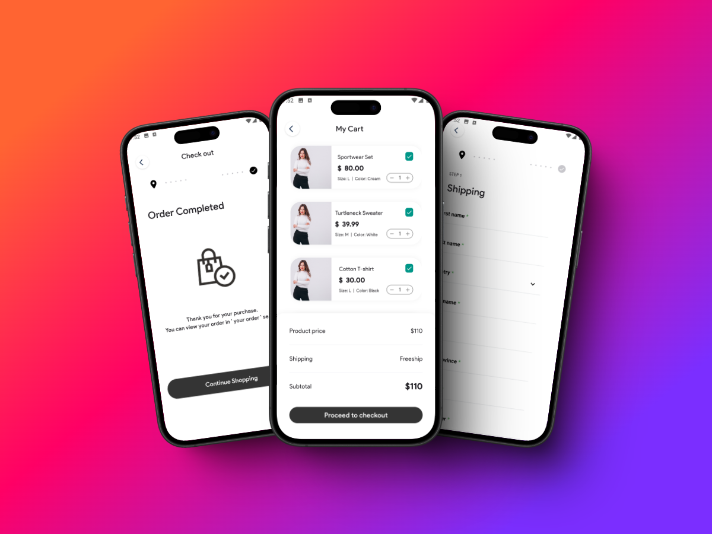
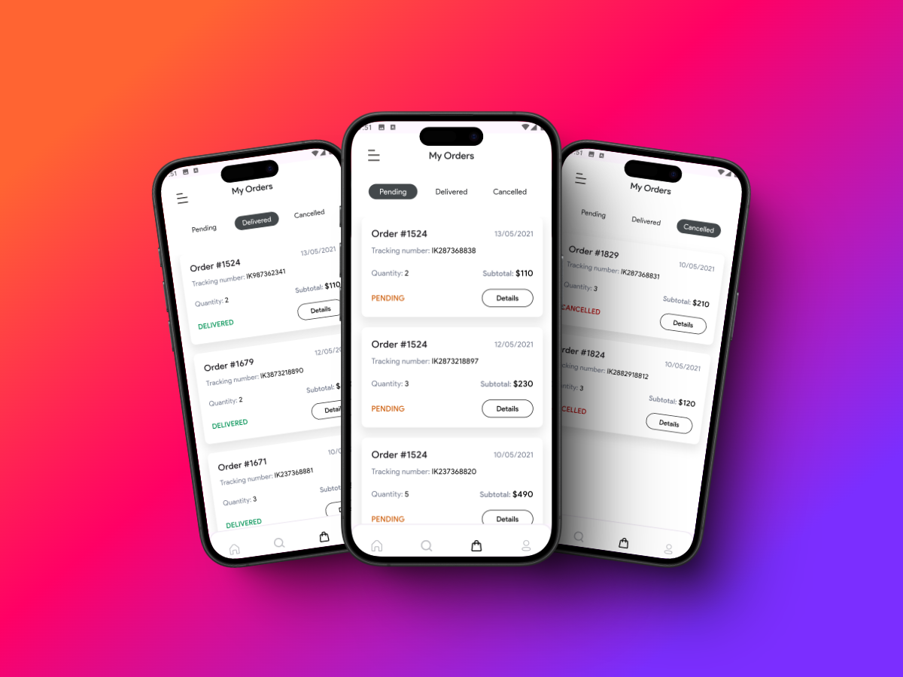
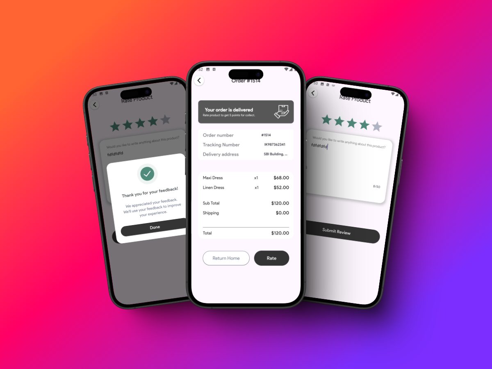
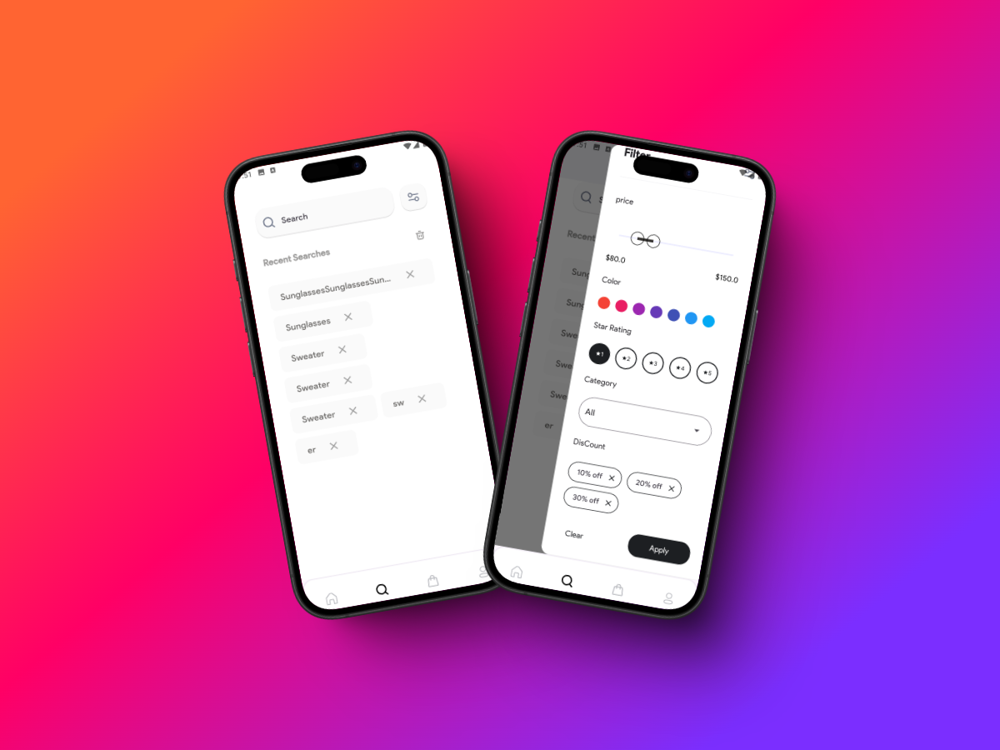

# Mentorship e-commerce app 


Whether you need to keep track of personal tasks or manage professional projects, UpTodo offers a range of tools to help you stay organized and focused.
1. [Installation](#installation)
2. [Usage](#usage)
3. [Images](#images)
4. [Video Demo](#video-demo)

   
## Installation 
1. Clone the repository:
   
    ```sh
    git clone https://github.com/KhaledElalfy1/mentorship-ecommerce.git
    ```

2. Navigate to the app directory:
    ```sh
    cd mentorship-ecommerce
    ```

3. Clean the project and install dependencies:
    ```sh
    flutter clean
    flutter pub get
    ```


    ## usage
     To run the project, use the following command:
     ```sh
       flutter run
     ```
## Images

#### Welcome Screen


#### onboarding Screen


#### Login & Home Screen


#### Product Details Screen


#### Order & Cart Screen





#### order details Screen




#### order and rate



#### Search Screen




#### Profile Screen


